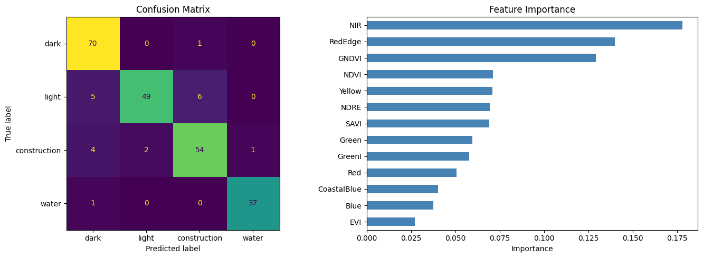
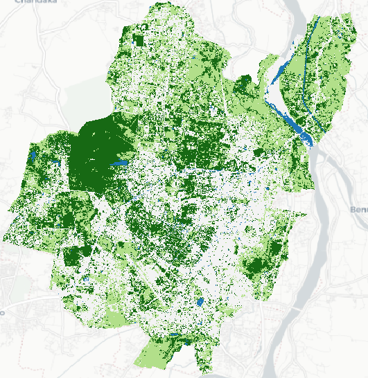
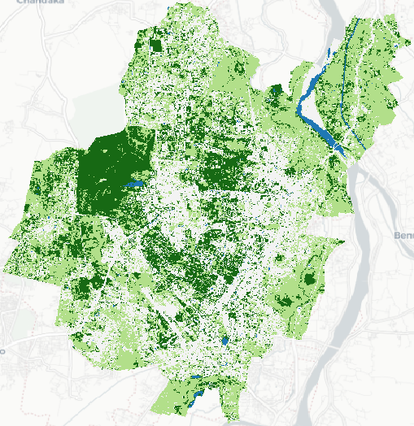
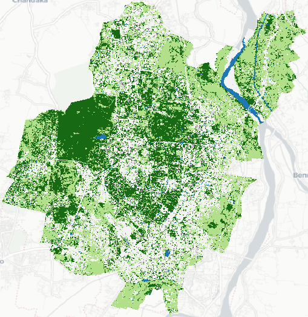
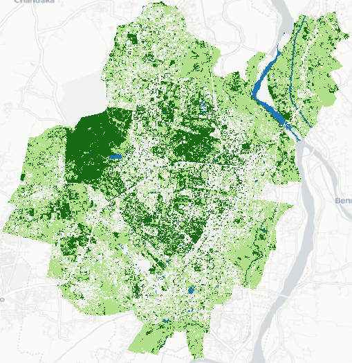
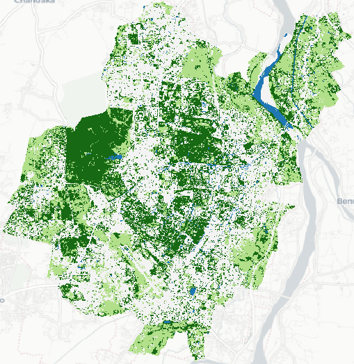
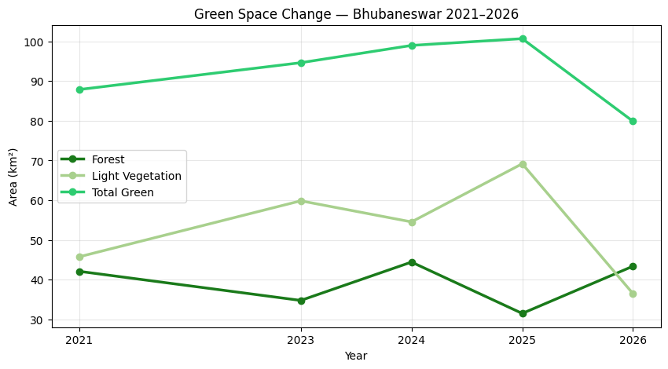
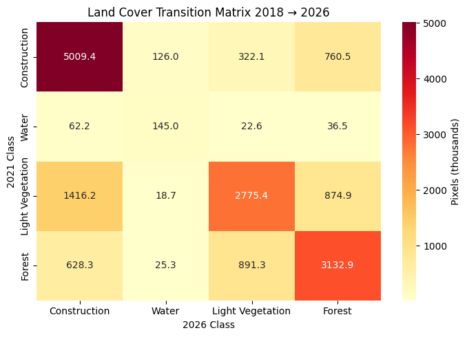

# Urban Green Mapping Of Bhubaneshwar city, Lab Based Project at NIST University

This repository contains the code, datasets and final GeoTIFF files from our lab based project titled *Urban Green Mapping of Bhubaneshwar City: Using Satellite Imgaery and Machine Learning Techniques*. 

The aim of this project was to train an ml model that can classify green areas which can then be used to create *[Urban Green Maps](https://discomap.eea.europa.eu/atlas/?page=Urban-green-spaces)*. A map illustrating the urban greenery of a city. 

## Overview
This analysis follows a supervised machine learning pipeline to classify urban land cover in Bhubaneswar across five temporal snapshots (2021,2023,2024,2025,2026), using multispectral satellite imagery from PlanetScope. The goal is to map the spatial distribution of green spaces and detect how they have changed over time.

## Repo Structure
```
├── assets
│   ├── 2021-ugm-map.png
│   .... other images
├── data
│   ├── construction.geojson  # 300 points of developed locations 
│   ├── dark.geojson          # 300 points of forested areas 
│   ├── light.geojson         # 300 points of lightly vegetated areas (shrubs, grasslands etc)
│   ├── mergedfile.geojson    # LCA boundaries of Bhubaneshwar city
│   └── water.geojson         # about 200 points of waterbodies
├── LICENSE
├── rasters
│   ├── clipped-classifed-2023.tif  # Classified GeoTIFF for the year 2021
│   ├── clipped-classified-2021.tif # Classified GeoTIFF for the year 2023
│   ├── clipped-classified-2024.tif # Classified GeoTIFF for the year 2024
│   ├── clipped-classified-2025.tif # Classified GeoTIFF for the year 2025
│   └── clipped-classified-2026.tif # Classified GeoTIFF for the year 2026
├── Readme.md
└── urbangreen.ipynb   # Jupyter notebook with training pipeline and results
```

### Step 1: Data Acquisition
Multispectral surface reflectance imagery was acquired from **PlanetScope's SuperDove sensor**, which captures 8 spectral bands: Coastal Blue, Blue, Green I, Green, Yellow, Red, Red Edge, and Near-Infrared (NIR). Images were downloaded for five years at approximately consistent seasonal windows to minimise phenological variation across time. All images cover the administrative extent of Bhubaneswar Municipal Corporation.


### Step 2: Training Data Collection (QGIS)
Ground truth training points were manually digitized in **QGIS** by visually interpreting the composite raster imagery. Approximately **1000 points** were collected across three land cover classes:

- **Forest** — dense tree canopy, deep green in appearance
- **Shrub** — low vegetation including grass, scrub, and parks
- **Developed** — impervious surfaces including roads, buildings, and bare ground

Points were saved as **GeoJSON files** and exported for use in Python. QGIS was used exclusively for digitizing and visual inspection; all analytical steps were performed in Python.

These can be found in the [data](data/) directory in this repo.


### Step 3: Feature Engineering
For each training point and subsequently each pixel in the raster, a feature vector was constructed consisting of:

- **8 raw spectral bands** (surface reflectance values, scaled 0–1)
- **5 derived spectral indices** known to discriminate vegetation cover:
  - **NDVI** (Normalized Difference Vegetation Index) — general vegetation density
  - **NDRE** (Normalized Difference Red Edge) — canopy chlorophyll, sensitive to vegetation stress
  - **GNDVI** (Green NDVI) — vegetation vigour using green band
  - **EVI** (Enhanced Vegetation Index) — reduces soil and atmospheric noise
  - **SAVI** (Soil Adjusted Vegetation Index) — reduces soil brightness effect, useful in sparse vegetation areas

This gives each pixel a **13-dimensional feature vector**. The use of spectral indices as supplementary features is well-supported in the literature, with studies on PlanetScope specifically identifying NDRE and GNDVI as top predictors for vegetation classification.

### Step 4: Sample Extraction
Band values and derived indices were sampled at each training point location by intersecting the point geometries with the raster pixel grid using `rasterio`. Points falling outside the raster extent or on nodata pixels were excluded. The resulting dataset was a tabular matrix of shape **(n_points × 13 features)** with an associated class label column.


### Step 5: Model Training
A **Random Forest classifier** was trained on the extracted samples using `scikit-learn`. Random Forest was chosen over SVM for the following reasons:

- Handles high-dimensional feature spaces efficiently
- Scales well to large raster inference (millions of pixels)
- Robust to outliers and class imbalance
- Provides interpretable feature importance scores
- Consistently outperforms SVM in remote sensing classification benchmarks

The dataset was split **80/20 into training and test sets** with stratified sampling to preserve class proportions. Model performance was evaluated using overall accuracy, per-class precision/recall/F1, and a confusion matrix.


### Step 6: Raster Classification
The trained model was applied to each of the five yearly rasters to produce **land cover classification maps**. Each raster was read band-by-band, spectral indices were computed on the full pixel grid, and the 13-band feature stack was passed through the classifier pixel-by-pixel. The output is a single-band classified raster with integer codes corresponding to Forest, Shrub, and Developed classes. Classified rasters were saved as GeoTIFF files.


### Step 7: Change Detection
Change was analysed both **statistically** and **spatially**:

- **Area statistics** — the total area (km²) of each class was computed for each year and plotted as a time series to reveal broad trends in green space coverage
- **Transition matrices** — a pixel-wise cross-tabulation between any two years reveals how many pixels transitioned between classes (e.g. Forest → Developed)

### Tools & Libraries

| Tool                     | Purpose                                |
| ------------------------ | -------------------------------------- |
| QGIS                     | Training point digitization            |
| `rasterio`               | Raster I/O and pixel sampling          |
| `geopandas`              | Vector point file handling             |
| `numpy`                  | Array operations and index computation |
| `scikit-learn`           | Random Forest training and evaluation  |
| `matplotlib` / `seaborn` | Visualisation and mapping              |
| `joblib`                 | Model serialisation                    |
| Google Colab             | Compute environment                    |


## Target Classes and their values
| class                         | value |
| ----------------------------- | ----- |
| construction                  | 0     |
| water                         | 1     |
| grasslands/light vegetation   | 2     |
| forests/trees/deep vegetation | 3     |

## Results
A model with the following evaluation metrics was obtained
```
              precision    recall  f1-score   support

        dark       0.88      0.99      0.93        71
       light       0.96      0.82      0.88        60
construction       0.89      0.89      0.89        61
       water       0.97      0.97      0.97        38

    accuracy                           0.91       230
   macro avg       0.92      0.92      0.92       230
weighted avg       0.92      0.91      0.91       230

```

Confusion matrix and the feature importance are shown below.
</img>

As shown, the NIR band seems to have the most importance. This is natural as healthy vegetation reflects most light in the NIR band. 
Vegetation sensitive indices like NDVI and GNDVI also rank high due to the same reason.

After classifying we obtained the following urban green maps. The GeoTIFF files can be found in the [rasters](rasters/) folder. Here's a visualisation of the years using QGIS

<table>
  <tr>
    <td></td>
    <td></td>
  </tr>
  <tr>
    <td align="center">2021</td>
    <td align="center">2023</td>
  </tr>
    <tr>
    <td></td>
    <td></td>
  </tr>
  <tr>
    <td align="center">2024</td>
    <td align="center">2025</td>
  </tr>
      <tr>
    <td></td>
  </tr>
  <tr>
    <td align="center">2026</td>
  </tr>
</table>

### Legend
Deep Green : Forests and Deep Vegetation
Light Green : Shrubs and Light vegetation
Gray : built up areas
Blue: waterbodies

## Statistics
Pixel wise counts were generated for each class for each year and the total vegetation area was calculated. The following statistics were obtained:
```
Water	Light Vegetation	Forest	Total Green
year				
2021	2.40	45.77	42.10	87.87
2023	1.75	59.85	34.77	94.62
2024	2.13	54.55	44.43	98.98
2025	1.88	69.18	31.50	100.68
2026	2.84	36.49	43.39	79
```

Visualizing this we get
</img>

Transition matrix as follows:
</img>

## Limitations
- The classifier was trained on points digitized from a single year's imagery. Reflectance differences across years due to varying atmospheric conditions and sun angles have not been algorthmically corrected. However, we have made best effort to manually select satellite images with minimal cloud covers and minimal sun glint.
- Seasonal variation in acquisition dates affects greenness and may account for some of the inter-annual variability observed in classified areas.
- The study area boundary is fixed to the 2022 administrative extent of Bhubaneswar Municipal Corporation.

## References
- Planet Labs. (2024). *PlanetScope Instrument Overview*. Planet Labs PBC.
- Kopecká, M.; Szatmári, D.; Rosina, K. *Analysis of Urban Green Spaces Based on Sentinel-2A: Case Studies from Slovakia*. Land 2017, 6, 25. https://doi.org/10.3390/land6020025 
- Zhuoqun Chai, Keyao Wen, Hao Fu, Mengxi Liu, Qian Shi,*Time-series urban green space mapping and analysis through automatic sample generation and seasonal consistency modification on Sentinel-2 data: A case study of Shanghai, China*, https://doi.org/10.1016/j.srs.2025.100215.

## Authors
- [Ashutosh Nayak](https://github.com/ashknl)
- [Mohit Pradhan](https://github.com/TsuKKi-is-dead)
- [Ayush Patel](https://github.com/8-Ayush-8)